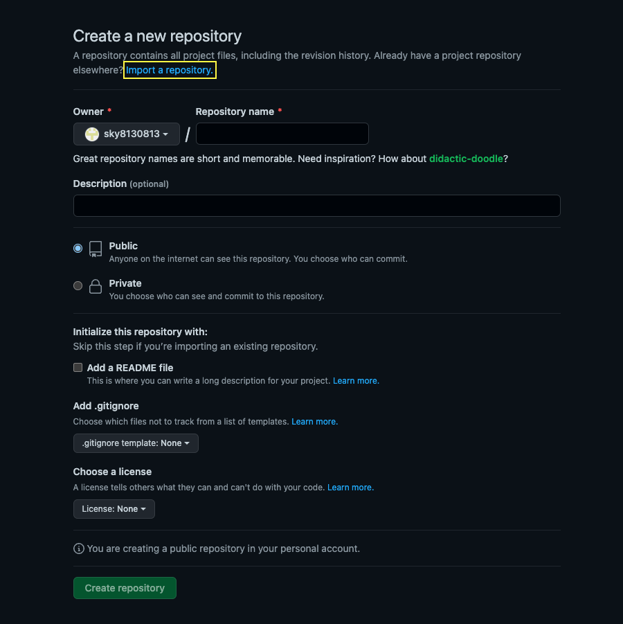
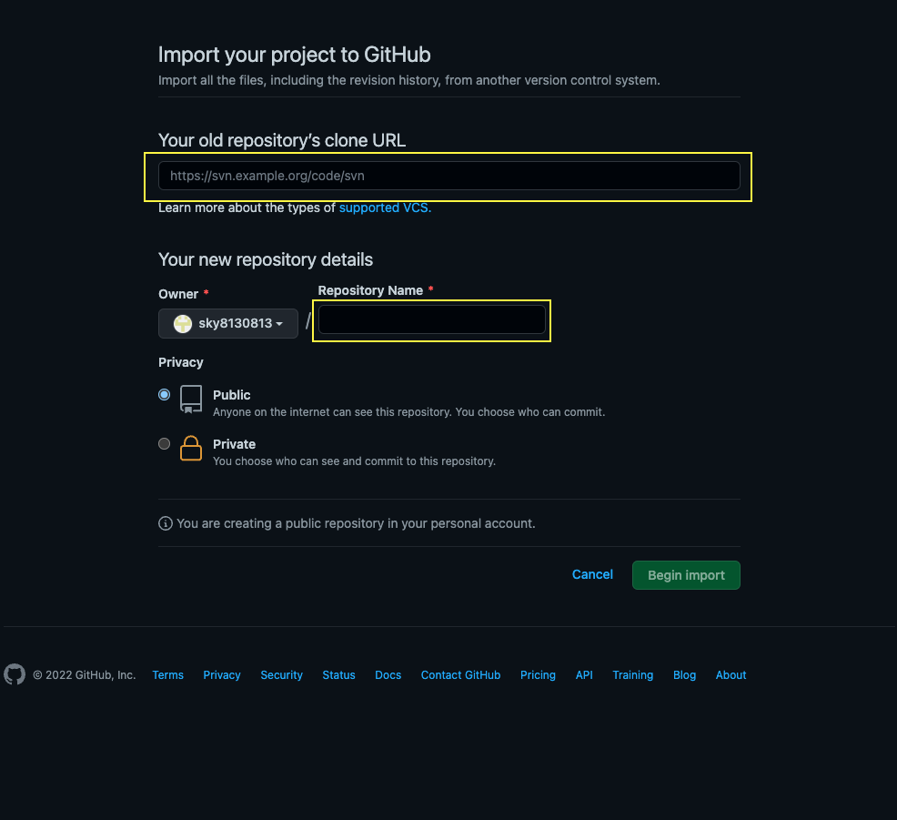
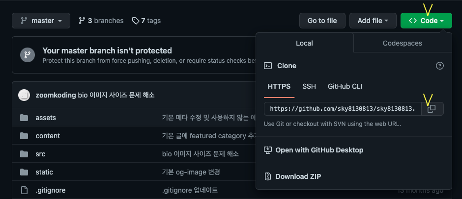
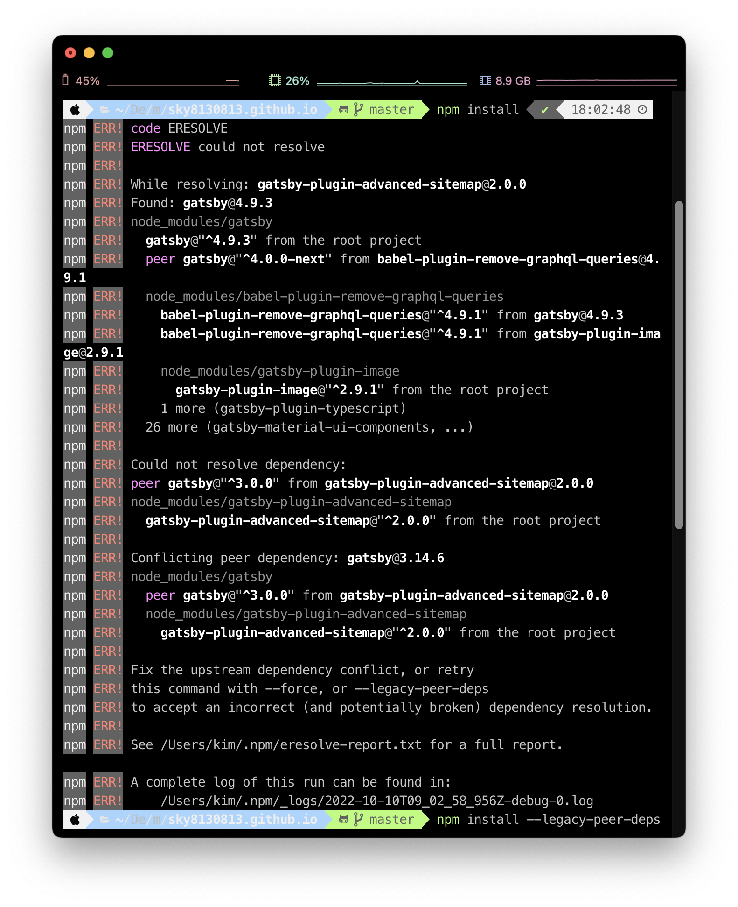
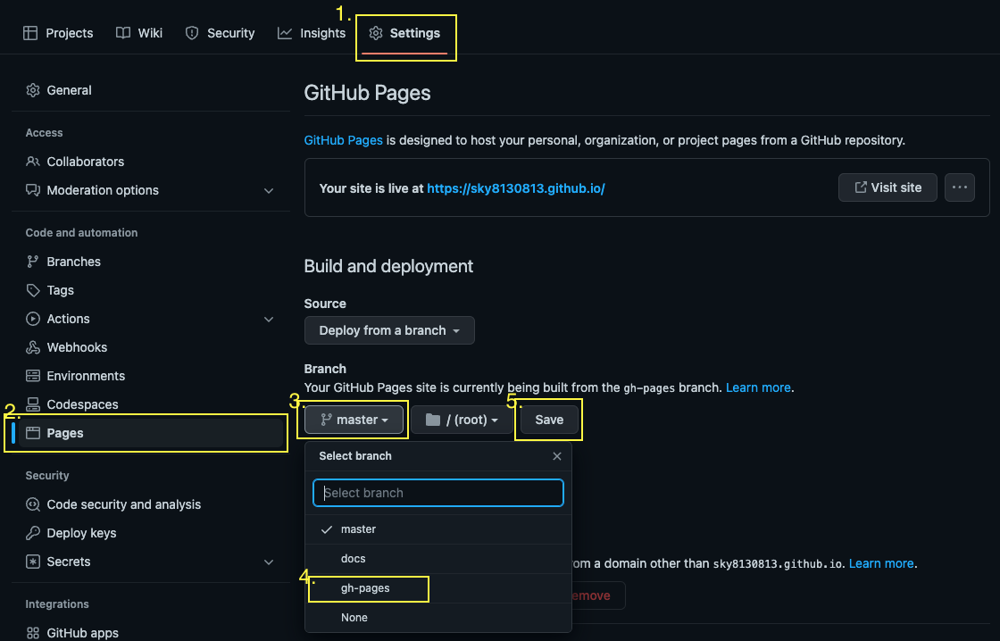

## 👋 안녕, github 블로그

블로그를 이곳저곳 이용해 보았지만 만족스럽지 못했다🥲 무엇보다 잔디 심기의 중요성을 알고 나서 github를 이용한 blog를 찾아 헤맸다가 [zoomkoding-Gatsby-blog](https://www.zoomkoding.com/Gatsby-github-blog/)를 발견했다!

**내 개발 블로그, 너로 정했다!**

## 🚀 만들기 시작!

테마를 이용하기에 있어서 GitHub Page로 배포하기를 선택했다.
[Netlify](https://app.netlify.com/start/deploy?repository=https://github.com/zoomkoding/zoomkoding-gatsby-blog)로 만들 수 있는 방법도 있다.

### 1. Repository 생성하기

GitHub Blog를 만들려면 Github에 Repository를 생성해야 하는데 평소 만들던 방법과 다르다.
_Import a repository_ 를 선택해서 Repo를 만든다.



그 이후 두 가지 정보를 넣어주는데, Your old repository's clone URL에는 [https://github.com/zoomKoding/zoomkoding.com](https://github.com/zoomKoding/zoomkoding.com) 를 입력한다.

> 사용하고자 하는 Gatsby 테마가 있는 repository의 주소를 넣으면 된다.
> 나는 *zoomkoding*님의 테마를 선택했다.

그다음, Repository Name을 입력한다. 이때 주의할 점은 **Repository 명을 꼭 [GitHubID].github.io로 설정**해야 한다.



### 2. Repository 가져오기

내 컴퓨터(local)에 Repository 가져와 보자!



이미지처럼 한 후에 아래 명령어를 터미널에서 실행해야 한다.

```bash
cd [Repository를 저장할 폴더]
git clone [복사한 주소]
```

### 3. Blog 설치하기

이제 블로그를 동작시킬 수 있도록 패키지들을 다운로드 해야 하는데, 다음 명령어를 실행하면 된다.

```bash
cd [Repository 주소]
npm install
```

> **_npm install_ 했더니 에러가?** 
> 잘 확인하면 해결 방법도 같이 제시하고 있다.
> `npm install --force` 또는 `npm install --legacy-peer-deps` 로 다시 실행하면 된다

### 4. Blog 배포 준비하기

그리고 이제 Gatsby 테마를 GitHub 페이지에 올리기 위해 gh-pages라는 패키지를 설치해야 한다.

```bash
npm install gh-pages --save-dev
```

그리고 나서 package·JSON에 다음을 추가한다.

```json
{
  "scripts": {
    "deploy": "gatsby build && gh-pages -d public" // 추가
  }
}
```

### 5. Blog 배포하기

드디어 배포 준비는 다 끝! 다음 명령을 실행하면서 github page에 배포하면 된다.

```bash
npm run deploy
```

조금 기다린 후에 `Published`라는 메시지를 받으면 배포는 끝!

### 6. Repository Source Branch 변경하기

GitHub 페이지가 작동하려면 GitHub의 Repository 설정에서 배포할 Branch를 선택해야 한다.

1. Repository에 있는 Settings를 클릭 -> 좌측 메뉴에서 Pages를 클릭 -> Github Pages 설정 페이지로 이동
2. Branch를 master(main)에서 gh-pages로 변경 -> Save



### 7. 배포된 페이지 확인하기

이제 실제로 잘 배포가 되었는지 확인해보자! [GitHubID].github.io에 접근했을 때 블로그가 잘 나온다!

> 가끔 README.md의 내용이 나오기도 하는데, 바로 적용이 안 되어서 그렇다. 보통은 좀 더 기다렸다가 다시 접근하면 정상적으로 나온다

### 8. 수정하고 배포하기

변동사항을 commit 후에 아래 명령어를 실행하면 변동사항이 블로그에 배포된다!

```bash
npm run deploy
```

배포 전, 로컬에서 확인하고 싶다면!

```bash
npm start
```

---

> - Gatsby 테마 적용 후 테마 최신 버전으로 업데이트하려면,  
>   Gatsby Theme을 제공하는 저장소를 가리키는 upstream이라는 새 원격 저장소를 추가 해야 한다.
>
> ```bash
> git remote add upstream [Gatsby Theme을 제공하는 저장소 주소].git
> ```
>
> > - 현재 테마를 이용한다면,
> >
> > ````bash
> > git remote add upstream https://github.com/zoomkoding/zoomkoding-gatsby-blog.git```
> > ````
>
> 그 후 명령어를 통해 변동사항을 가져온다.
>
> ```bash
> git pull upstream master
> ```

## ✨

멋진 github 블로그가 생겼다! 앞으로 공부하면서 얻는 지식, 의문 등 남길 예정이다🤭

```toc

```
