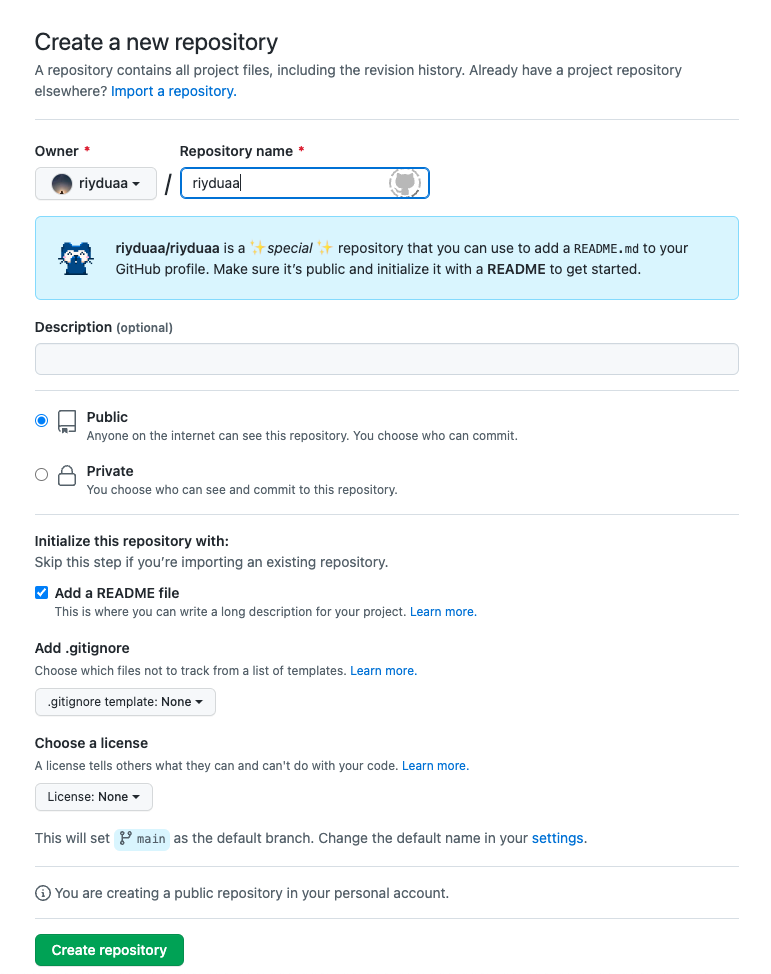
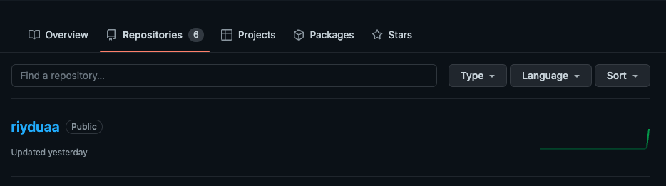
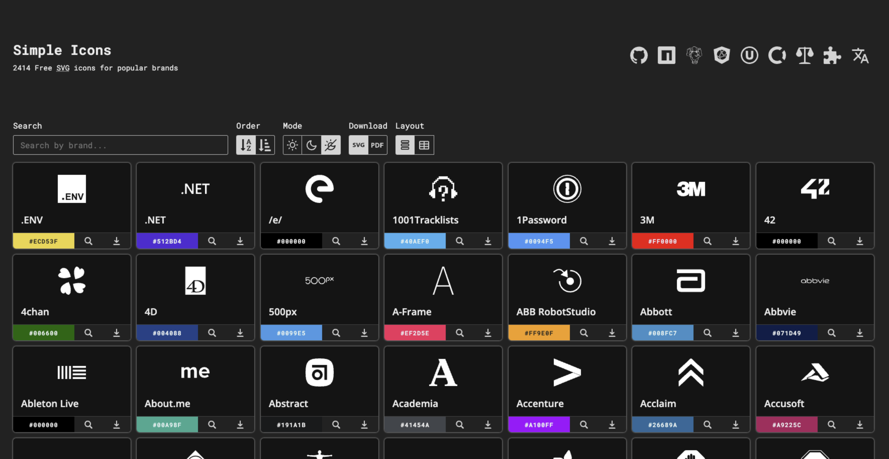
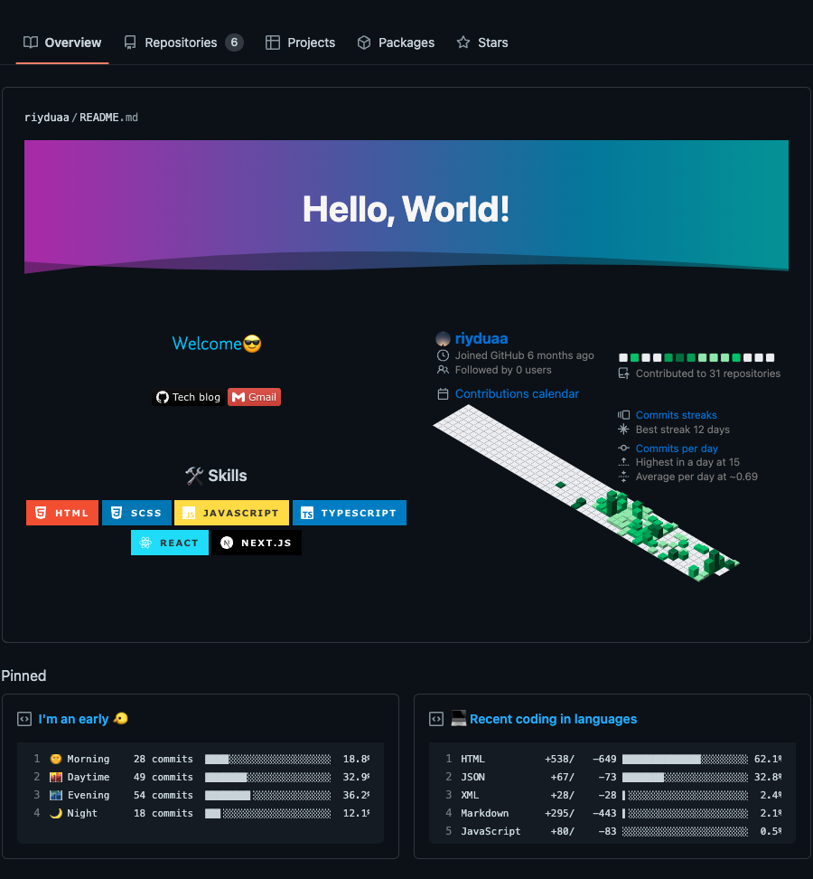

## 🤨 Github Overview를 꾸미고 싶어!

나의 github에 들어 왔을 때, 나를 표현하면서도 보기 좋게 꾸미고 싶었다. 그래서 여러 방면으로 찾아본 후 꾸며 보았다. 생각보다 다양해서 나눠서 포스팅을 결정했다.

## Github Overview의 README 만들기

Github의 이스터 에그 같은 README! 깃허브 유저 아이디와 동일하게 리포지토리 명을 지정해서 만들면 *Overview의 README*를 만들 수 있다!



> 1. Public 선택
> 2. **Add a README file 선택**
> 3. Create repository

그 이후 꾸미기는 새로 생성된 리포지토리에서 **마크다운(markdown)** 또는 **HTML 태그**로 _README.md_ 파일에서 수정하면 된다.



> [마크다운 작성법](https://gist.github.com/ihoneymon/652be052a0727ad59601)에 대한 좋은 글이 있어서 첨부!

## Github README 꾸미기 추천!

꾸미기에는 정말 많은 방법과 오픈 소스들이 존재한다. 그 중 많이 사용하는 위주로 설명하려 한다.

### [capsule render](https://github.com/kyechan99/capsule-render) : 헤더 및 푸터

다양하게 꾸밀 수 있는 오픈소스!

테마가 굉장히 다양해서 눈을 사로잡는 헤더로, 맺음 짓는 푸터로 사용하거나 헤더 및 푸터 둘 다로 사용해서 통일성을 주기도 한다! 찾아보면서 제일 마음에 들었던 오픈소스다.


### [Shields io](https://shields.io/) : 뱃지

제일 많이 사용하는 뱃지! 보통 내가 사용할 수 있는 스킬 등을 소개할 때 많이들 쓴다.


```bash
// html tag


// markdown

```

테크 블로그나 링크를 연결하고 싶을 경우,

```bash
// html tag
<a href="링크"></a>

// markdown
[](링크)
```

> 한글로 되어 있는 부분을 나에게 맞게 쓰면 된다.

### [simple icons](https://simpleicons.org/) : 뱃지 로고

뱃지를 이용할때 그 해당하는 로고와 컬러를 찾을 수 있다.



### [github-readme-stats](https://github.com/anuraghazra/github-readme-stats) : 깃허브 README stats star 표시

github를 통합적으로 분석 후 표시를 해준다. 다양하게 테마를 꾸밀 수 있으니 링크를 통해 보면 좋을 듯 하다.


## ✨

다양한 꾸미기 팁들이 존재하니 검색을 통해서 점차 더 추가 해도 좋을 듯 하다!

최종 나의 완성한 리드미!

이렇게 완성하면서 알게 된 지식들을 포스팅 할 예정이다 😎

<br/>

```toc

```
