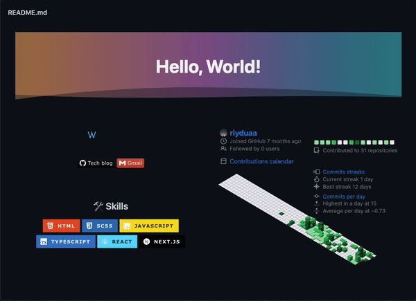
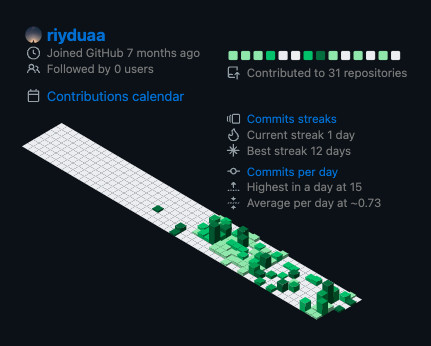
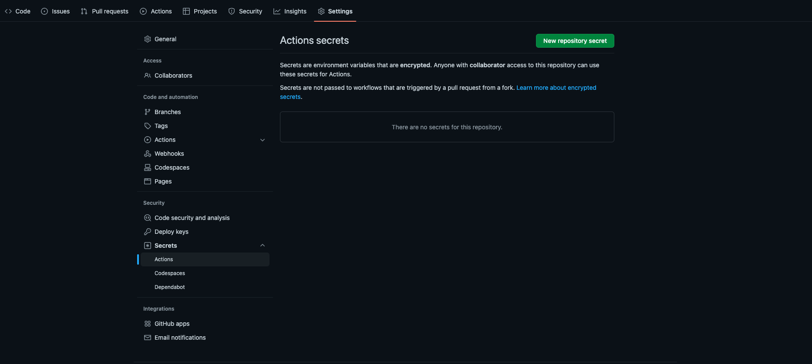
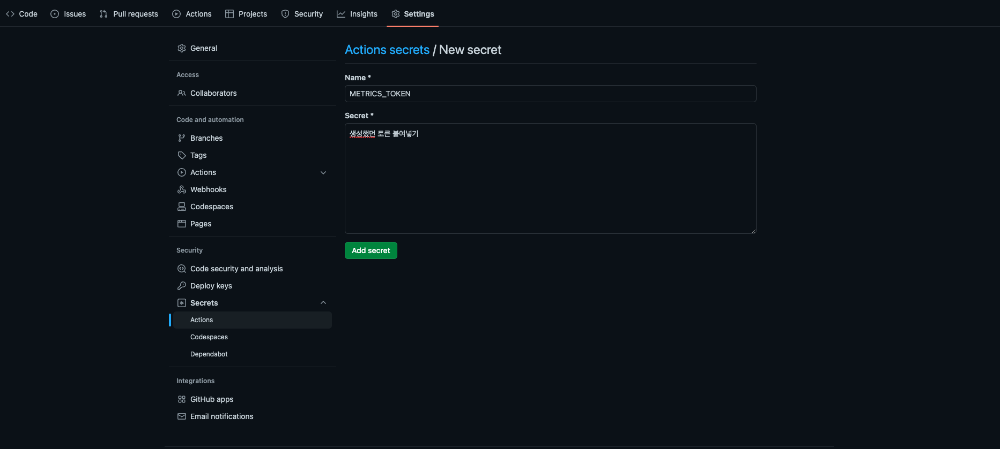
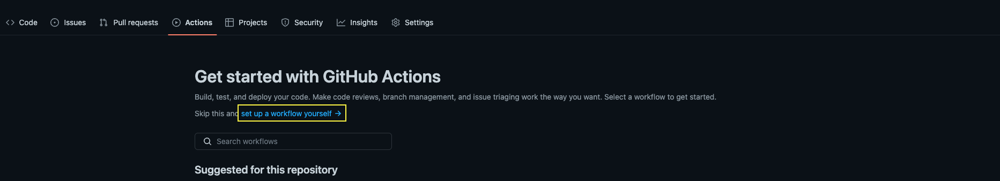
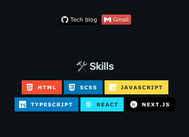

## 내 리드미 꾸미기 과정!

내 리드미의 완성된 모습! 전부 기록으로 남기려한다😉


> 마크다운으로 작성이 가능하지만 HTML요소를 추가하다보니 잘 인식이 안되기도 하고 이미지의 크기 조절이 어려워서 전부 HTML로 작성하게 되었다. _혹시 모르니 마크다운 버전도 같이 기록해야겠다!_
>
> ```bash
> <div align="center">
> ...
> </div>
> ```
>
> `<div align="center">` 태그로 감싸서 가운데 정렬 적용했다

<br />

### [capsule render](https://github.com/kyechan99/capsule-render) : 헤더 적용


```bash


or


```

> 1. `width="100%"`를 주면서 최대 화면 크기에 따른 길이를 유지하도록 했다.
> 2. `type=waving&color=gradient` 타입을 웨이빙으로 선택, 컬러는 그라디언트를 선택해서 새로고침 시 랜덤으로 그라디언트가 되도록 설정했다.
> 3. `animation=twinkling` 애니메이션을 설정해서 타이틀에 재미를 줬다.

<br />

### [Metrics](https://github.com/lowlighter/metrics/blob/master/source/plugins/isocalendar/README.md) : 아이소메트릭 커밋 캘린터 적용



> 이 방법은 **github Actions**를 이용해야 해서 생각보다 오래 걸렸다.

1. 세팅에서 토큰을 생성한다.
   
   🔑 _public_access (default scope)_, _read:org_, _read:user_, _read:packages_, _repo_ 를 선택해서 생성한다.

   여기서 주의 할 점은 주어지는 토큰은 단 한번 보여지기 때문에 따로 복사해서 보관해야 한다.

2. readme repo 의 Settings 탭 > Secrets > Actions 에서 **New repository secret** 을 클릭한다.
   

3. 사진과 같이 Name과 Secret을 작성한다. (Secret에는 아까 생성한 토큰을 입력한다.)
   

4. readme repo 의 Actions 탭 > **set up a workflow yourself** 클릭
   

5. `metrics.yml` 이란 이름으로 코드를 작성한다.

   ```bash
   name: Metrics
   on:
     schedule: [{cron: "0 * * * *"}]
     workflow_dispatch:
     push: {branches: "master" 또는 "main"}
   jobs:
     github-metrics:
       runs-on: ubuntu-latest
       permissions:
         contents: write
       steps:
         - uses: lowlighter/metrics@latest
           with:
             token: ${{ secrets.METRICS_TOKEN }}

             user: 유저네임 입력
             template: classic
             base: header
             config_timezone: Asia/Seoul
             plugin_isocalendar: yes
             plugin_isocalendar_duration: full-year
   ```

6. 그러면 끝! 그 이후 매번 생성될 _github-metrics.svg_ 파일을 리드미에 입력해주면 된다.

   ```bash
   

   or

   
   ```

   <br />

### [Readme Typing SVG](https://github.com/denvercoder1/readme-typing-svg) : 서브 타이틀 적용


> 움직이는 텍스트로 역동적임을 보여주는 한 편, 지루하지 않게 해주는 거 같다.

```bash


or


```

<br />

### [shields](https://shields.io/) : 배지 적용



> 배지는 두가지가 있다. 링크를 연결하는 것과 그저 보여주는 것이다.

1. 링크 연결

   ```bash
   <a href="https://kim228sy.github.io"></a>

   or

   [](https://kim228sy.github.io)
   ```

2. 일반 배지

   ```bash
   

   or

   
   ```

   <br />

## ✨

이렇게 내가 현재 사용하고 있는 리드미를 자세하게 다뤘다. 다양한 꾸미기가 존재하니 검색을 통해서 추가로 갖춰도 좋을 듯하다😊

<br/>

```toc

```
