## **Pinned** 및 **Gists** 활용해서 Overview를 꾸미자!

github꾸미기 시리즈 마지막 포스트다. 최종 나의 github 모습!

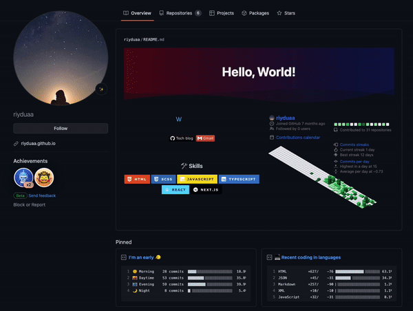

> 오늘 소개하려는 꾸미기는 _Pinned_ 과 **gist** 를 이용한 꾸미기다.
> 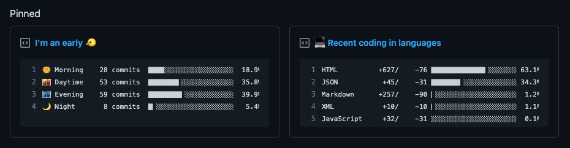

### [productive-box](https://github.com/maxam2017/productive-box) : 커밋 통계를 통한 나의 타입은?

#### 1. fork 하기

이 [링크](https://github.com/maxam2017/productive-box)로 들어가서 fork 한다.

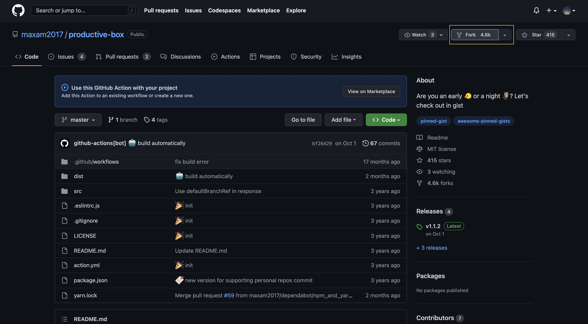

#### 2. gist 만들기

1. 우측 상단의 본인 프로필 > **Your gists** 클릭

   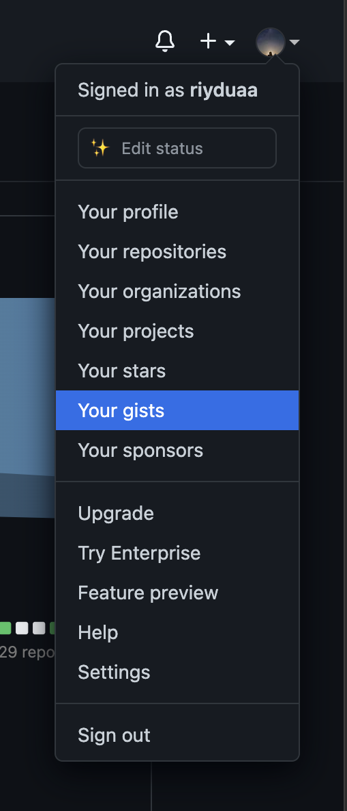

2. **Create a gist** 클릭

   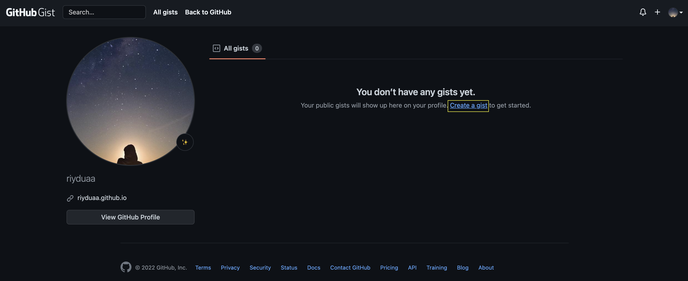

3. **Create public gist** 클릭

   내용은 적당히 입력! 적용 후 자동으로 변경되니 상관없다.
   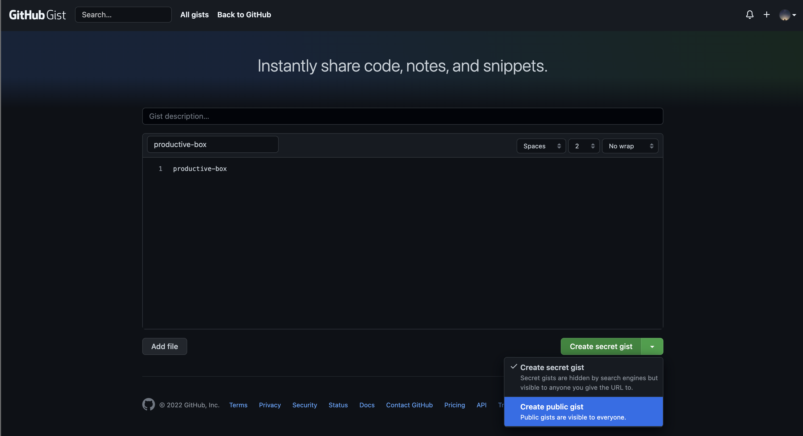

4. gist.github.com/[유저네임]/**[이 부분 복사]**

   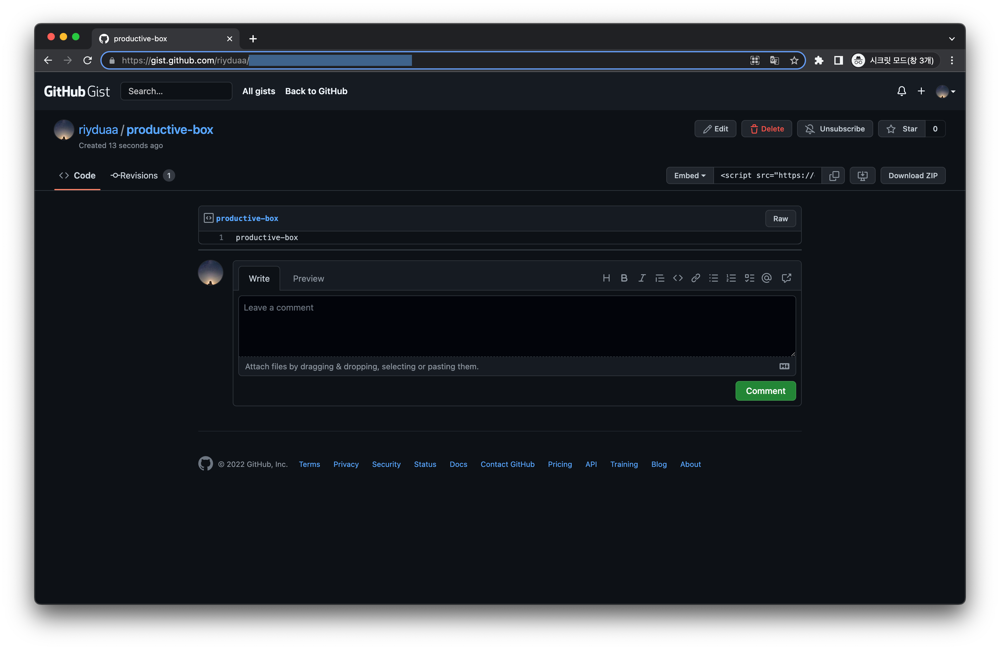

#### 3. token 만들기

1. 우측 상단의 본인 프로필 > **Settings** 클릭

   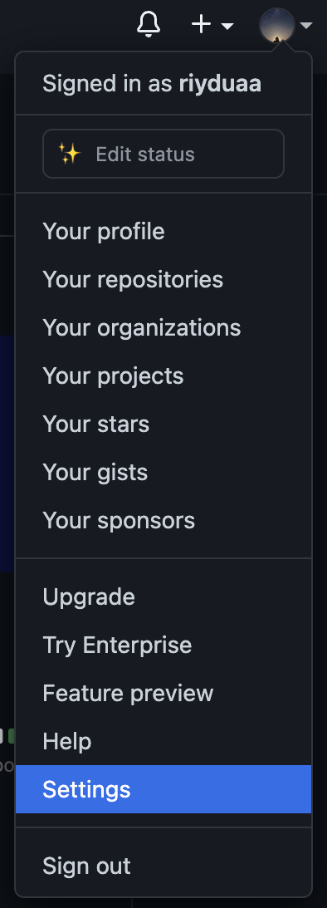

2. **Developer settings** 클릭

   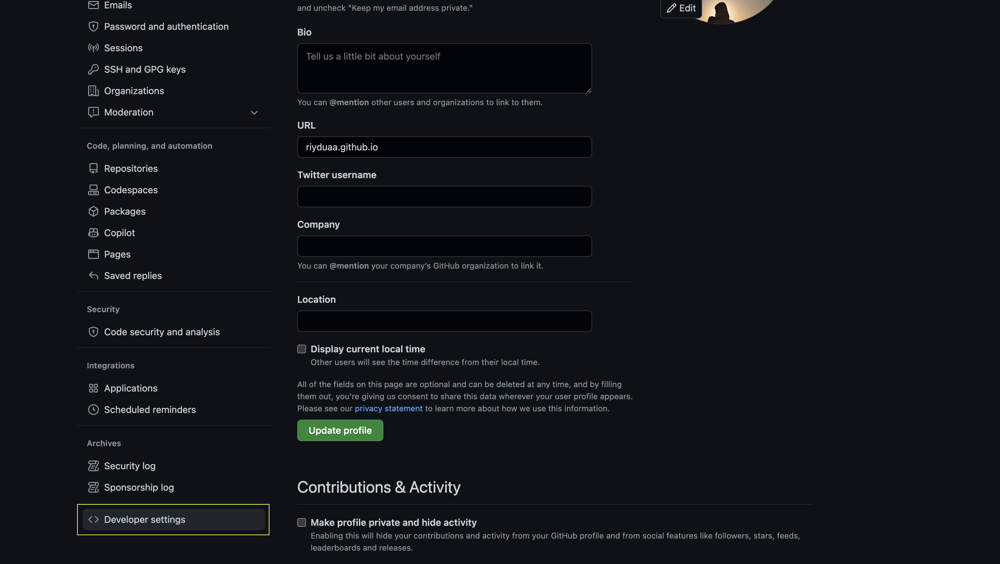

3. Tokens (classic) > **Generate new token (classic)** 클릭

   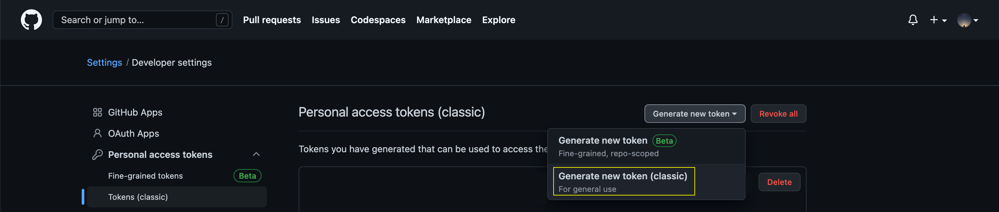

4. `repo`, `gist` 선택 후 생성 > 생성된 토큰 복사! (다시 생성되지 않으니 보관)

   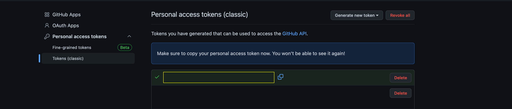

#### 4. Gist 및 Token 등록하기

1. fork한 _productive-box 리포지토리_ 의 Settings > Actions > New repository secret 선택

   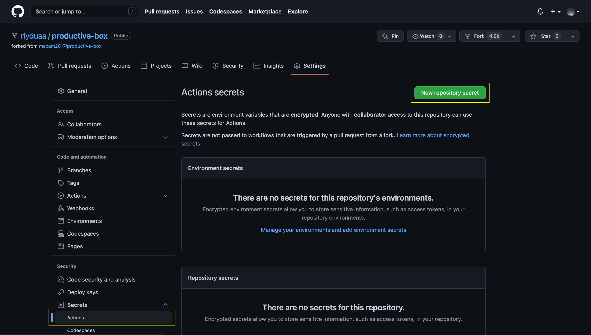

2. Name - `GIST_ID`, Secret - `아까 복사 해 둔 gist 주소 뒷 부분` 입력 > **Add secret** 클릭

   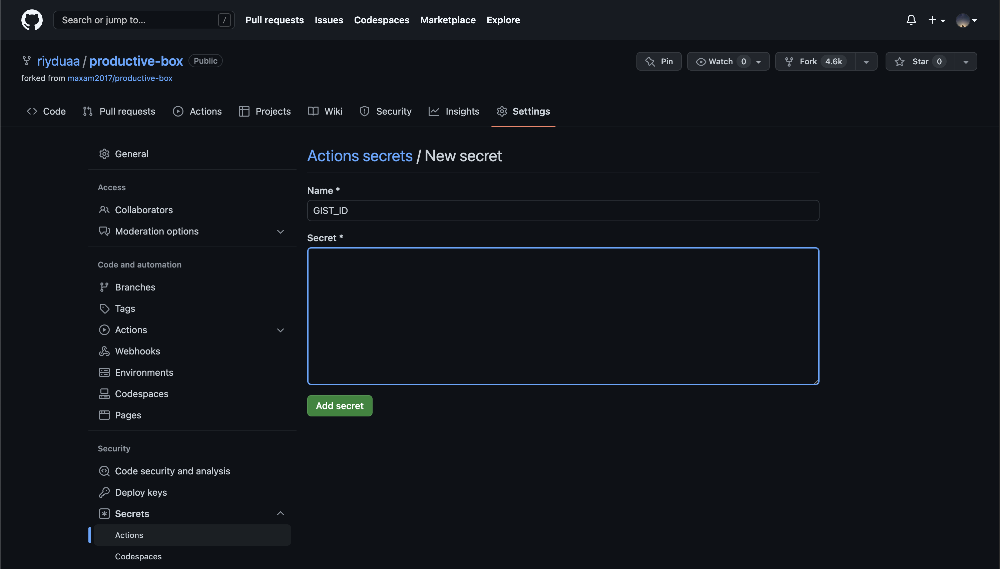

3. Name - `GH_TOKEN`, Secret - `아까 복사 했던 토큰` 입력 > **Add secret** 클릭

   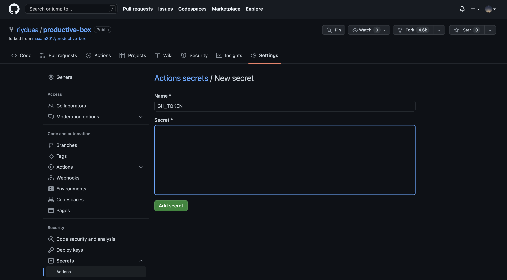

#### 5. Github Actions 이용하기

1. **understand my workflows, go ahead and enable them** 클릭
   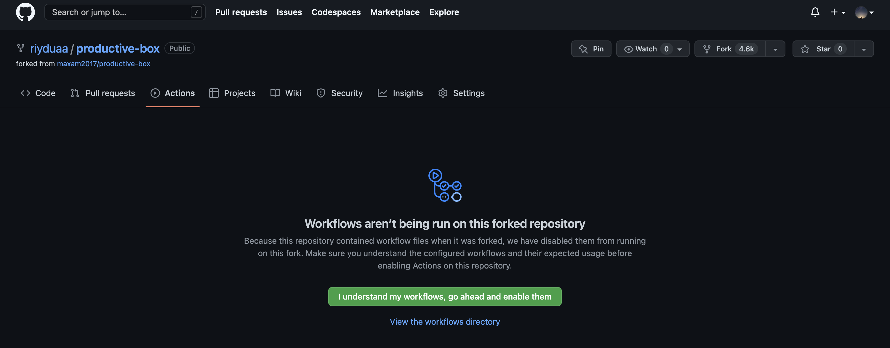

2. Update gist > Enable workflow 클릭

   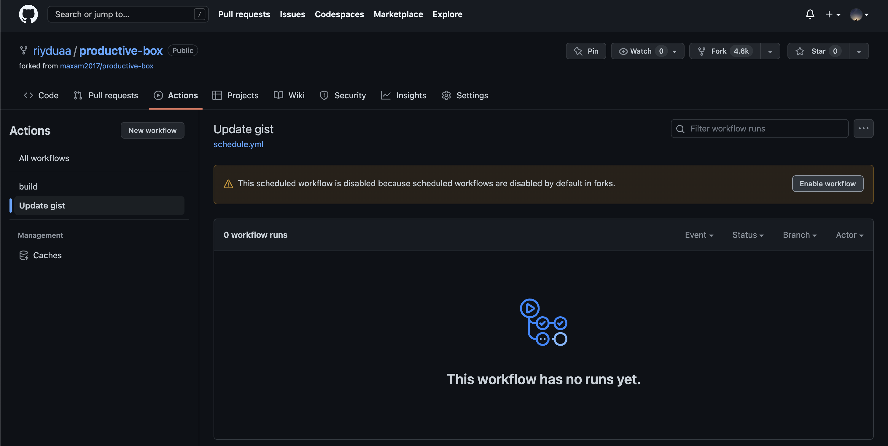

3. 조금 지나면 알아서 생성이 되는데, 수정해야 하는 부분이 있다.

   ```bash
   GIST_ID: 9842e074b8ee46aef76fd0d493bae0ed
   TIMEZONE: Asia/Taipei

   GIST_ID: ${{ secrets.GIST_ID }}
   TIMEZONE: Asia/Seoul
   ```

   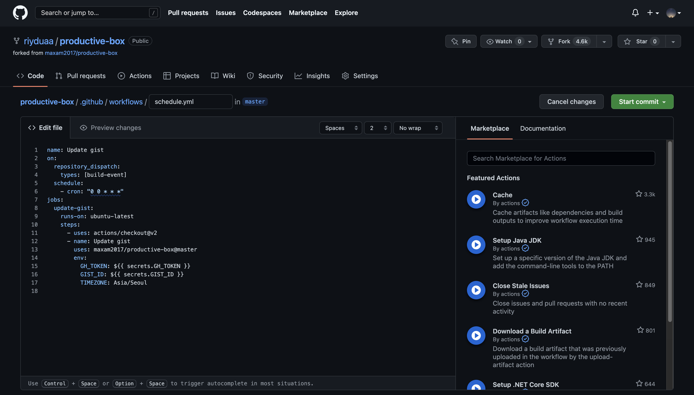

#### 6. Pinned로 보여주기

1. github의 Overview 탭 리드미 밑, **Customize your pins** 클릭

   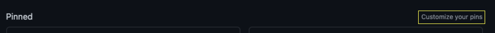

2. 선택해서 보여줄 Repositories 및 Gists 선택 > Save pins

   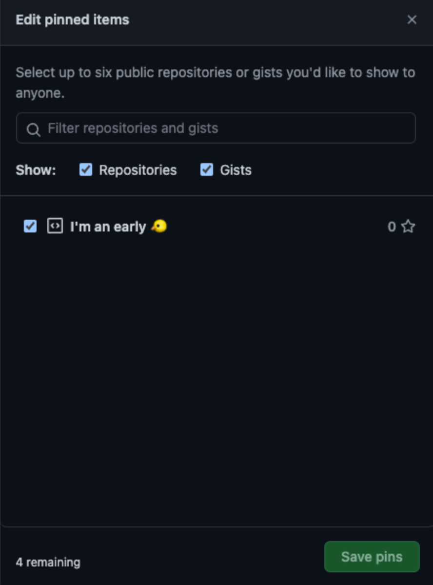

## ✨

이렇게 Github 꾸미기 시리즈 포스트는 끝이다😎

내가 원한 것은 웹 상에서 한 페이지에 README와 Pinned를 통한 나를 보여주기 였다. 내가 보통 **어떤 시간대에 커밋**을 하는 어떤 타입의 사람인지, **어떤 언어를 커밋**하는지 보여주는 것을 등록했다. 앞으로 더 꾸미기 좋은 오픈소스가 있다면 더 꾸미기도 좋다👍

<br/>

```toc

```
