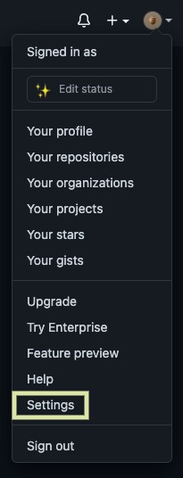
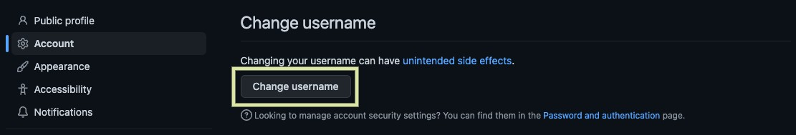
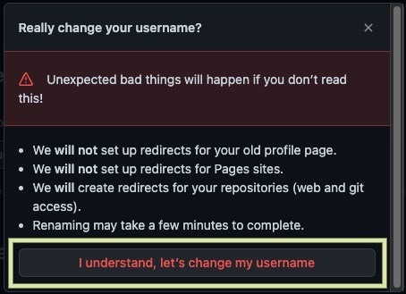
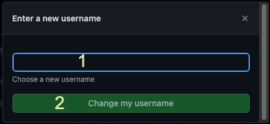
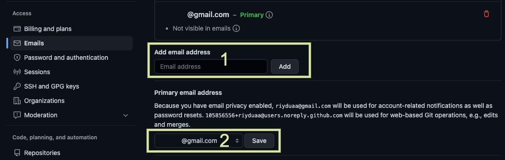

## 🤔 내 Github 이름이 영 마음에 안드는데?

급하게 github에 연동해서 하다보니 잘 쓰지 않는 gmail을 연결했다. 조금 여유가 생겼으니 _고쳐볼까_ 한다.

> 내가 변경하고자 하는 것
>
> 1. username
> 2. email

### Github 사용자 이름 / 이메일 변경

> [GitHub Docs](https://docs.github.com/en/account-and-profile/setting-up-and-managing-your-personal-account-on-github/managing-personal-account-settings/changing-your-github-username) 참고

**1. 프로필 사진 클릭 후 Settings 클릭**



**2. Account 클릭 후 Change username 클릭**



**3. 사용자 이름 변경에 대한 경고 확인 후 I understand, let's change my username 클릭**



**4. 새로운 사용자 이름 입력 후 Change my username 클릭**



**5. Emails 클릭 후 Add email address 입력/Add 클릭, Primary email address 선택/Save 클릭**



> 이러면 github 상에서 username과 email을 변경하게 된다.
> 그런데 우리는 git 도 사용중이다. git의 username과 email을 변경하자!

### Git 사용자 이름 / 이메일 변경

git 같은 경우, *컴퓨터(local)의 모든 리포지토리에 대한 설정*과 *단일 리포지토리에 대한 설정*이 있다. 필요에 따라 공식 문서를 확인하고 설정하면 된다.

> [GitHub Docs](https://docs.github.com/en/get-started/getting-started-with-git/setting-your-username-in-git) 참고

#### 1. 단일 리포지토리에 대한 변경

```bash
// 터미널에서 변경하고 싶은 리포지토리의 위치로 이동

git config user.name [변경할 계정 이름]

git config user.email [변경할 계정 이메일]
```

#### 2. 모든 리포지토리에 대한 변경

```bash
// 터미널 실행

git config user.name // 현재 이름 확인

git config user.email // 현재 이메일 확인

git config --global user.name [변경할 계정 이름]

git config --global user.email [변경할 계정 이메일]
```

## 🫢 끝난게 아니다! 로컬에서 github 주소 변경

github에서 username을 변경해서 리포지토리 주소들이 죄다 바뀌어있다. 로컬에서 자동으로 변경되지 않으니 우리가 직접 바꿔야 한다.

### 로컬 저장소에서 주소 변경

```bash
// 현재 저장소 주소를 확인
git remote -v

// 저장소 주소 변경
git remote set-url origin [연결할 주소]

// push나 pull, fetch를 할 경우 username과 password를 다시 입력해야 한다
```

> 변경된 리포지토리를 새로 `clone` 받는 방법으로도 된다.

## ✨

정상적으로 username과 email을 변경했다🤭

<br/>

```toc

```
