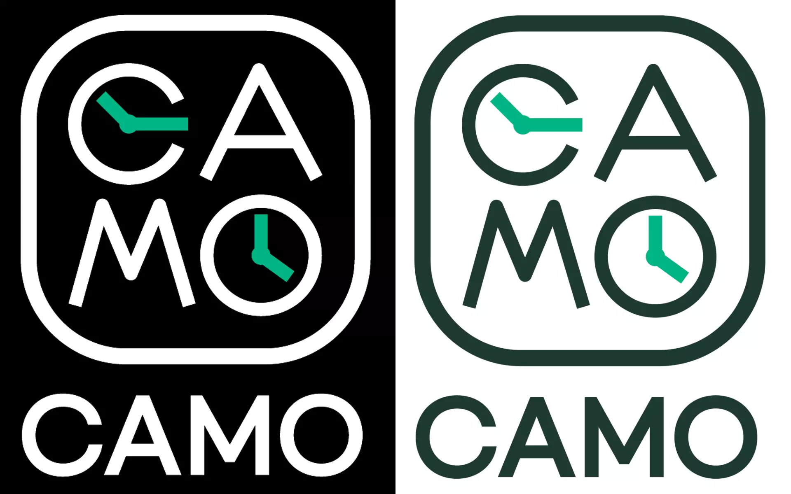
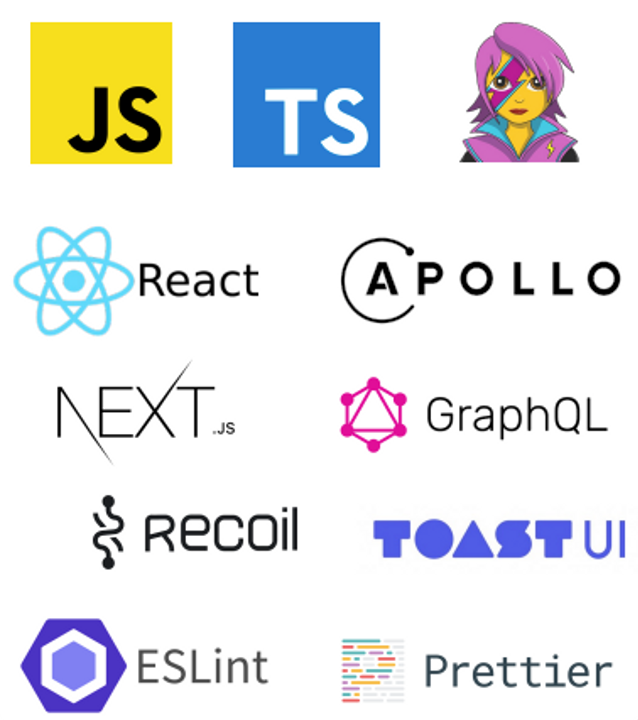
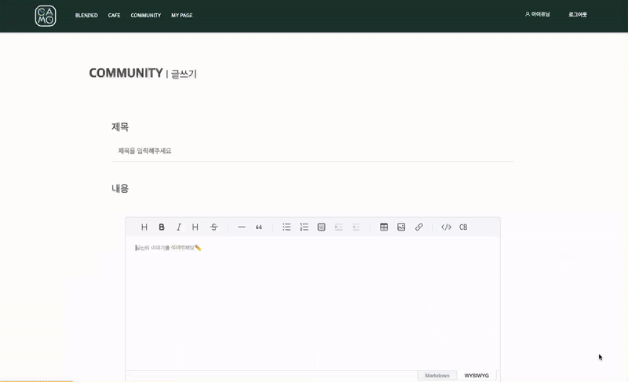

## 💡 소개



> 프로젝트 기간: 2022.09 - 2022.10 (약 2개월)

'**CAMO(Cafe Moment)**'는 카페에서의 특별한 순간을 전달하기 위해 만들어진 공간입니다.  
우리 주변에는 너무나 많은 카페가 있습니다. 같은 모습과 맛을 가진 가맹점 카페들이 즐비한 우리 주변에서 커피를 마시는 건 어렵지 않습니다.  
그렇기에 잘 보이지 않아서 알 수 없었던 작은 카페들을 알릴 수 있는 계기가 되기 위해 기획했습니다.  
나만 알고 있기 아쉬운 우리 주변의 숨겨진 카페들을 찾아 커뮤니티에 공유하고 커피를 좋아하는 다른 사람들에게 커피뿐만이 아닌 카페에서 느낄 수 있는 작은 행복을 선물하세요.

카모(CAMO)는 그동안 발견하지 못했던 특별한 매력을 가진 카페들을 당신에게 알려줄 **커뮤니티 공간**입니다.

## 기술 스택



## 시연

- 커뮤니티 게시글 목록

  - 최신순, 인기순으로 정렬된 다른 목록이 보이게 만들었다.
  - 페이지 국가를 이용하여 게시글을 10개 단위로 보이게 구분했다.
  - 등록한 사진 중 가장 먼저 등록한 사진을 대표 사진으로 보이게 했다.
  - 사진, 제목, 태그, , 작성자가 드러나게 했다.
  - 2단 그리드를 이용하여 간결하면서도 필요한 정보는 노출했다.

    

- 커뮤니티 게시글 등록

  - 컴포넌트를 분리하여 등록과 수정을 할 수 있게 만들었다.
  - 내용은 TOAST UI를 이용하여 작성할 수 있게 했다.
  - 지도를 통해 소개하고자 하는 카페의 위치를 표시할 수 있게 했다.

    

- 커뮤니티 게시글 및 댓글

  - 게시글이 등록된 내용이 다 노출되도록 구성했다.
  - 누르면 게시글에 해당하는 수가 보이게 노출했다.
  - 게시글에 대한 댓글을 작성할 수 있게 만들었다.
  - 게시글을 작성한 계정과 로그인한 계정이 같을 시, 수정 및 삭제를 할 수 있게 구분했다.

    

> API를 백엔드 공부하는 분께 제공받아 작업하게 되었다.

```toc

```
