## 💡 소개


> 프로젝트 기간: 2022.12.1 - 2022.12.30 (약 1개월)

<br />

'**HI We(하이 위)**'는 후원이 필요한 동물 및 단체와 후원자를 연결해서 후원이 진행되도록 하면서 교류도 할 수 있는 사이트입니다.  
후원이 필요한 단체와 동물들이 우리가 모르는 곳에도 존재합니다. 그들은 인스타그램, 유튜브, 트위터 등 많은 SNS상에서 존재하는 걸 알 수 있습니다.  
그들에게는 후원받을 수 있도록 하고, 후원자는 정보를 더 쉽게 확인할 수 있는 공간을 제공합니다.  
또한, 익명 커뮤니티 공간을 제공하므로 피 후원 대상, 후원자 할 것 없이 편하게 교류할 수 있습니다.

## 기술 스택

- React
- Next.js
- Typescript
- Emotion

## 시연

- 반응형 디자인을 적용하였다.

### 랜딩 페이지

- 동영상을 랜딩 페이지에 이용하여 사이트의 정체성을 보여준다.


### 메인 페이지

- 캐러셀을 이용하여 배너를 보여주고, 페이지 이동은 드롭다운 형식으로 만들었다.

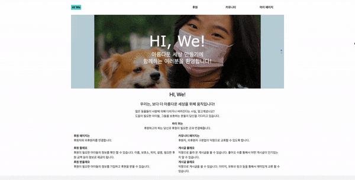
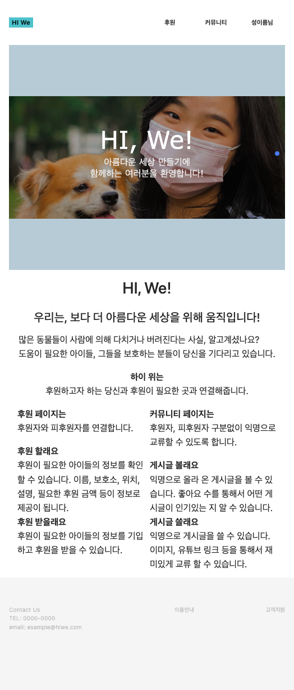

### 로그인 / 회원가입 페이지

- 이메일 형식 또는 비밀번호 형식에 맞지 않으면 에러 메시지를 보여준다.

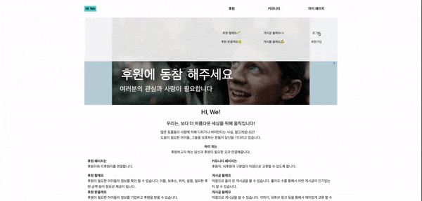
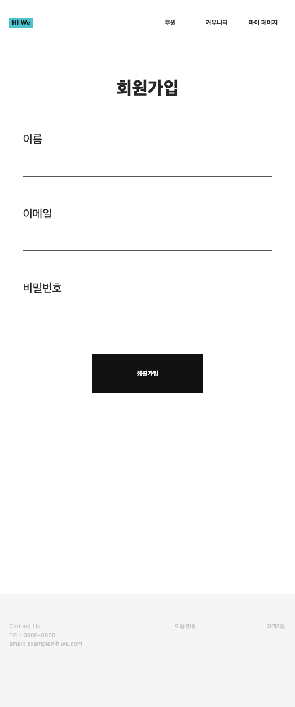

### 후원 페이지

- 후원자가 피 후원 대상을 후원할 수 있는 페이지이다.

#### 목록 페이지

- 이미지를 메인으로 보여주는 목록에 맞게 무한 스크롤을 적용하였다.
- '좋아요'가 표기되어 어떤 대상이 관심을 많이 받고 있는지 알 수 있다.

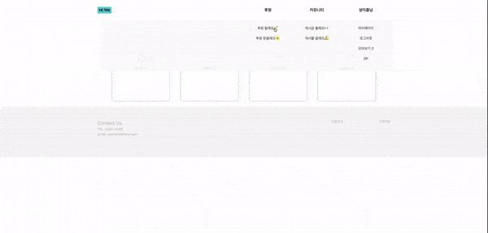
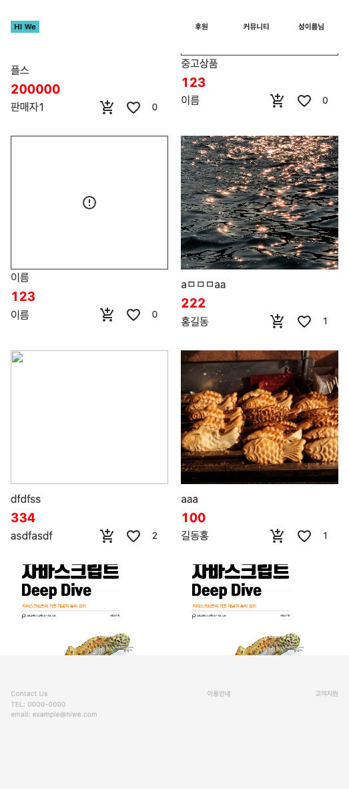

#### 상세 페이지

- 후원하기 버튼으로 후원으로 결제되고, 모아보기 버튼으로 마이페이지에서 따로 볼 수 있다.
- 질문하기를 통하여 피 후원 대상에 대한 질문을 남길 수 있다.
- 권한 분기를 이용해 작성 계정, 로그인 계정이 같으면 게시글을 수정 / 삭제할 수 있다.

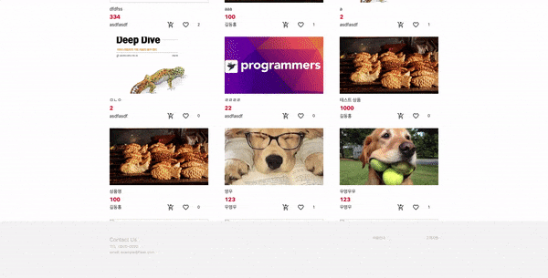
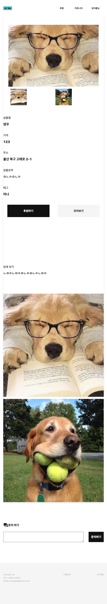

#### 등록 페이지

- 피 후원 대상의 정보를 기재할 수 있다.

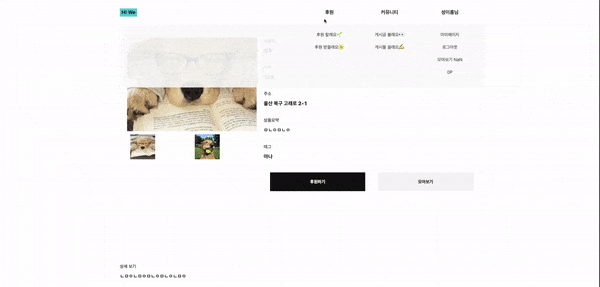
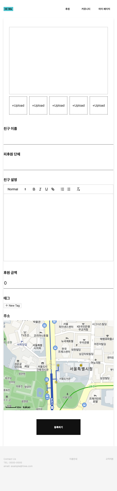

### 커뮤니티 페이지

- 피 후원, 후원 관계없이 자유롭게 교류할 수 있는 페이지이다.

#### 목록 페이지

- 페이지네이션으로 목록을 보여주며, '좋아요' 수를 표기하여 각 게시글의 인기를 확인할 수 있다.

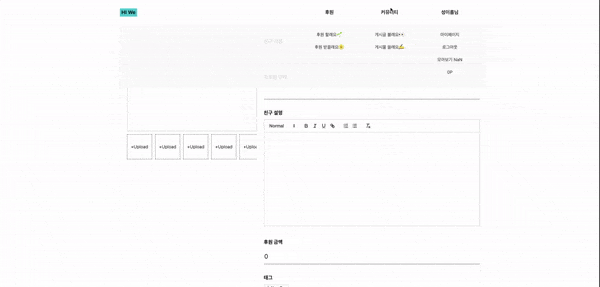
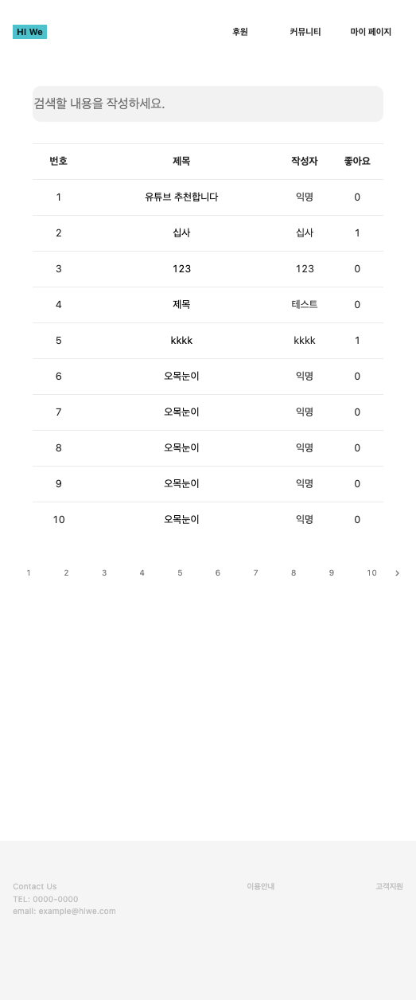

#### 상세 페이지

- 교류하는 페이지에 맞게 이미지, 유튜브 등을 보여주고, 좋아요 / 싫어요. 평가를 남길 수 있다.
- 익명으로 댓글을 남겨 교류할 수 있다.
- 비밀번호를 통하여 게시글을 수정 / 삭제할 수 있다.

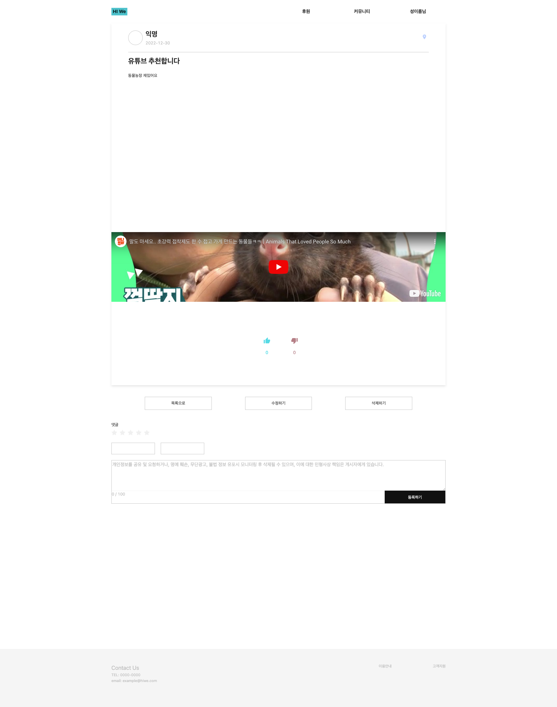
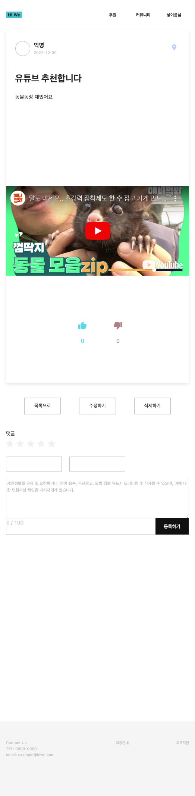

#### 등록 페이지

- 익명으로 게시글을 작성할 수 있으며, 비밀번호를 기재하게 되어있다.

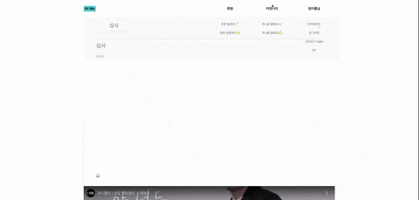
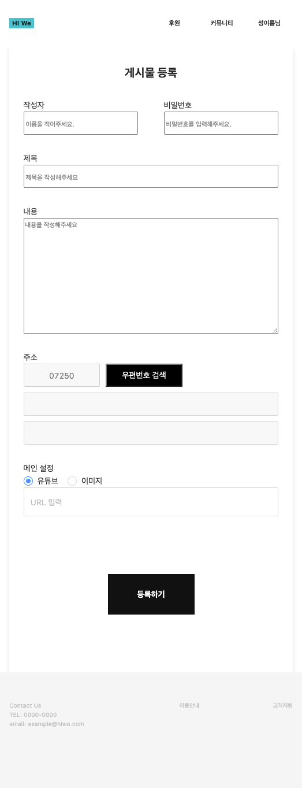

### 마이 페이지

- 후원을 위한 포인트를 충전할 수 있다.
- 찜한 친구를 통해서 내가 '좋아요'를 한 대상을 볼 수 있다.
- 후원한 내용을 확인할 수 있다.
- 모아보기를 통해서 후원하고자 한 대상들을 따로 볼 수 있다.

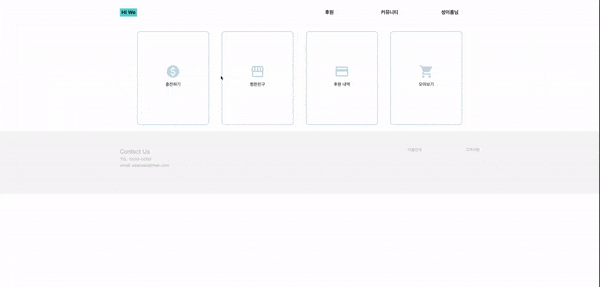
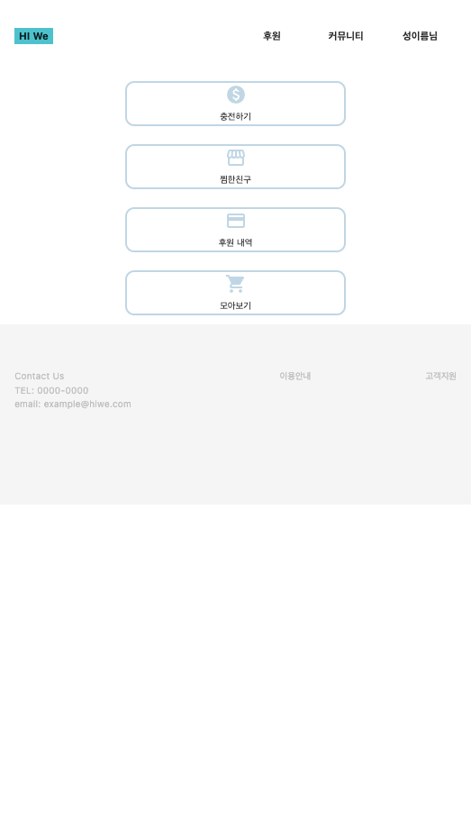
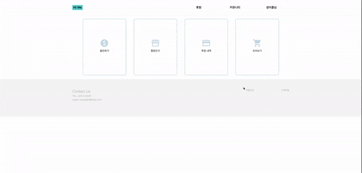
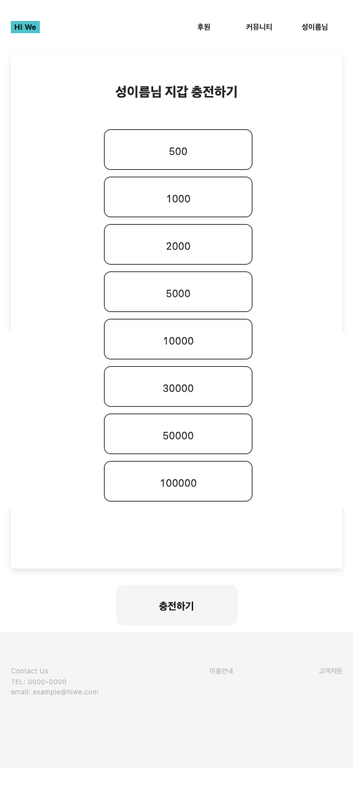

> API는 제공받아 작업했다.

<br/>

```toc

```
